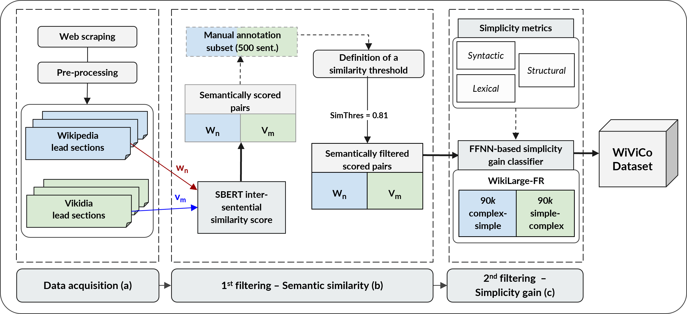

# WiViCo | Wikipedia Vikidia Corpus
### A general-purpose parallel sentence simplification dataset for French

<p align="center">
    <a href="https://github.com/lormaechea/wivico/archive/refs/heads/main.zip">
        
    </a>
</p>

## Introduction: 

This repository provides a general-purpose *complex-simple* parallel sentence simplification dataset for French language: __*Wikipedia-Vikidia Corpus*, WiViCo__. 

<!--It results from the experiments performed in the following [paper](https://to_appear).-->

## Background & Goals:

While Automatic Text Simplification (ATS) appears to be an interesting task from a societal and computational perspective, the lack of monolingual parallel data prevents an agile implementation of ATS models, especially in less resource-rich languages than English. For these reasons, we aimed to investigate how to create a general-language parallel simplification dataset for French using a method to extract __complex-simple__ sentence pairs from comparable corpora like Wikipedia and its simplified counterpart, Vikidia. 

By developing a __two-step automatic filtering method__ to mine register-diversified comparable corpora (shown in __Figure 1__), we sequentially address the two primary conditions that must be satisfied for a simplified sentence to be considered valid: 

1. __*preservation of the original meaning*__, that we addressed with the use of *n*:*m*-aware SBERT-based cosine similarities; and
2. __*simplicity gain with respect to the source text*__, that we treated with a text simplicity classification model.


<p align="center">
    <small><b>Figure 1 - Overview of the complete filtering pipeline to obtain <i>complex-simple</i> <br> sentence pairs from the French versions of Wikipedia and Vikidia.</b></small>
</p>

Using this approach, we provide in this repository a dataset of parallel sentence simplifications (__WiViCo__) that can be later used for training French sequence-to-sequence general-language ATS models for French, or to fine-tune a pretrained LLM for the downstream task.

## Repository structure:

The ```v.1``` subfolder contains the first version of the WiViCo corpus (```wivico_dataset_v1.tar.gz```), comprising parallel *complex-simple* pairs extracted from the French editions of Wikipedia and Vikidia. 
 
Utilizing the sigmoid output layer of the classifier we provide simplification pairs based on lenient or stricter thresholds:

```
wiki_sent	viki_sent 0.5	0.6	0.7	0.8	0.9 alignment
L'iMac est la gamme d’ordinateurs tout-en-un grand public d’Apple depuis 1998.	L'iMac d'Apple est une gamme d'ordinateur tout-en-un .	1	1	1	1	0   1:1
L'Open d'Australie est l'un des tournois de tennis de la catégorie du Grand Chelem organisé depuis 1905.	Au tennis, l'Open d'Australie est un tournoi qui fait partie de la catégorie des Grands Chelems.	1	1	1	1	1   1:1
```

Based on different cutoff probability thresholds, we enumerate all $Wn:Vm$ samples in each class. In this manner, researchers can benefit from this incremental approach and make use of the subset that suits their needs.

## A special focus on intra- and inter-sentential simplifications:

Since we intended to capture all simplification operations, we decided to take into account both intra- and inter-sentential transformations:

- __*Intra-sentential* operations__, referring to the simplification changes that are produced within the scope of one single sentence (that is, on a *1*:*1* basis). These include word(s) substitution, reordering, paraphrasing as well as deletion, in the context of superfluous information (see __Examples 1, 2__).

- __*Inter-sentential* operations__, referring to the changes involving several sentences, that is, on a *n*:*m* basis:
    - *Divergence* (or *splitting*), that is, dividing long sentences into shorter and less complex segments (with *m*>*n*) (see __Example 3__).
    - *Convergence* (or *compression*), namely, rewriting *n* sentences into a simpler and more compact version *n*>1 and *m*<*n* (see __Example 4__).

| Examples | ***Wikipedia sentence*** | ***Vikidia sentence*** | Align.|
| ---- | ---- | --- | ---- |
| __Ex.01__ | L'expression « Maison-Blanche » est souvent employée pour désigner, par métonymie, l'administration du président.  | Par métonymie, la Maison-Blanche désigne aussi le gouvernement américain et son entourage. | __1:1__ |
| __Ex.02__ | Lio, de son vrai nom Vanda Maria Ribeiro Furtado Tavares de Vasconcelos, née le 17 juin 1962 à Mangualde au Portugal, est une chanteuse et actrice luso-belge francophone. | Lio, de son vrai nom Vanda Maria Ribeiro Furtado Tavares de Vasconcelos, est une chanteuse et actrice luso-belge francophone. Elle est née le 17 juin 1962 à Mangualde au Portugal. | __1:2__ |
| __Ex.03__ | La Ligue internationale contre le racisme et l'antisémitisme (LICRA) est une association luttant contre le racisme et l'antisémitisme en France, mais également sur le plan international. Elle est fondée en 1927 sous le nom de Ligue internationale contre l'antisémitisme (LICA). |  La Ligue internationale contre le racisme et l'antisémitisme (LICRA) est une association anti-raciste et anti-discrimination créée en 1927 qui agit dans le monde entier. | __2:1__ |

## Citing & Authors

<!--If you find this repository helpful, feel free to cite our publication [Extracting sentence simplification pairs from French comparable corpora using a two-step filtering method](https://to_appear):

```bibtex 
@inproceedings{ormaechea-2023-extracting-simplification-pairs,
    title = {Extracting sentence simplification pairs from French comparable corpora using a two-step filtering method},
    author = {Lucía Ormaechea and Nikos Tsourakis},
    booktitle = {Proceedings of the Swiss Text Analytics Conference 2023},
    month = {6},
    year = {2023},
    location = {Neuchâtel, Switzerland},
    publisher = {CEUR-WS},
    url = {To appear},
}
```
-->

__Contact person__: [Lucía Ormaechea](https://luciaormaechea.com/), [lucia.ormaecheagrijalba@unige.ch](mailto:lucia.ormaecheagrijalba@unige.ch)

If you have further questions, don't hesitate to send us an email.
