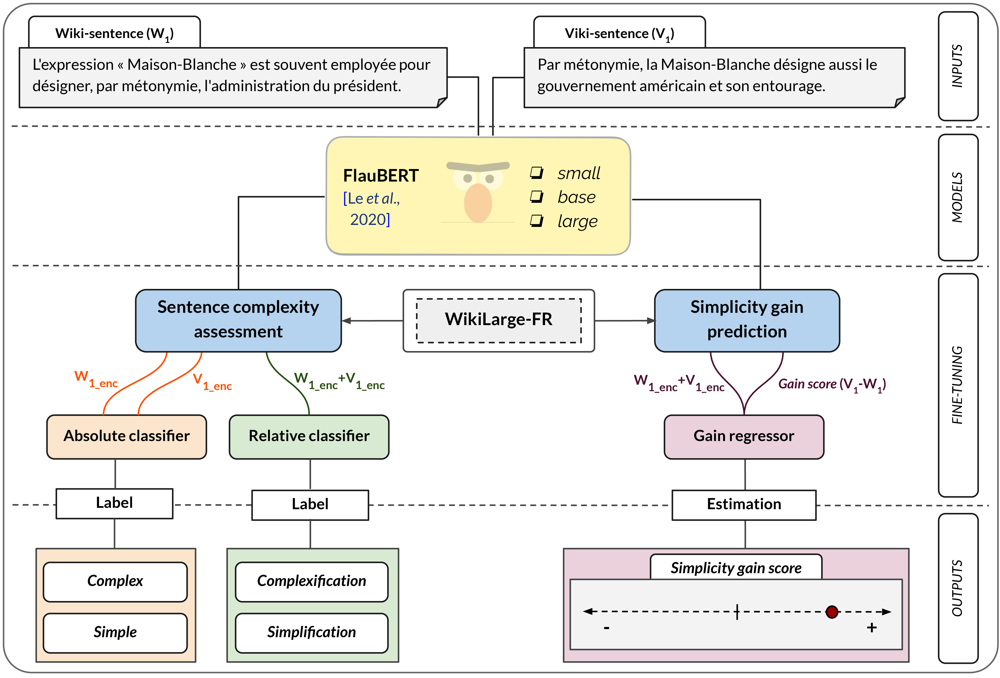

# WiViCo V.2 | Wikipedia Vikidia Corpus
### A general-purpose parallel sentence simplification dataset for French

<p align="center">
    <a href="https://github.com/lormaechea/wivico/raw/main/v.2/wivico_dataset_v2.tar.gz">
        
    </a>
</p>

## Introduction: 

This repository provides the second version of a general-purpose *complex-simpler* parallel sentence simplification dataset for French language: __*Wikipedia-Vikidia Corpus*, WiViCo__. 

It results from the experiments performed in the following conference paper:

> Lucía Ormaechea, Nikos Tsourakis, Didier Schwab, Pierrette Bouillon and Benjamin Lecouteux. *Simple, Simpler and Beyond: A Fine‑Tuning BERT‑Based Approach to Enhance Sentence Complexity Assessment for Text Simplification*. In: Proceedings of the 6th International Conference on Natural Language and Speech Processing (ICNSLP), Trento (Italy). 

## Background \& Goals:

Automatic Text Simplification (ATS) models face the challenge of generating outputs that, while being indeed simpler, still retain some complexity. This arises from the inherently relative nature of simplification, in which a given reference text is rewritten into a comparatively *simpler* version. Yet, simpler does not necessarily equate to *simple*.

We thus aim to propose a finer-grained method to assess sentence complexity in French. Our solution comprises a triad of increasingly fine-grained models so as to comprehensively qualify and quantify sentence simplicity. In this manner, we sequentially:
1. Determine whether a sentence is inherently __complex__ or __simple__, by means of an absolute sentence complexity classifier.
2. Assess if the second sentence in a pair is __simpler__ than the first, by using a relative sentence complexity classifier.
3. Measure the __simplification gain__ achieved by the second sentence in comparison to the original one.


<p align="center">
    <small><b>Figure 1 - Overview of the complete simplicity assessment task</b>.</small>
</p>

Our approach utilizes [FlauBERT](https://github.com/getalp/Flaubert), fine-tuned for classification and regression tasks. Based on our three-dimensional complexity analysis, we provide the second version of the WiViCo dataset, comprising 46,525 aligned *complex-simpler* pairs, which can be further leveraged to fine-tune LLMs to automatically generate simplified texts, or to assess text complexity with greater granularity.

## A special focus on the relative nature of simplification:

Predicting sentence complexity seems a valuable ancillary task for ATS, as it can contribute to the automatic creation of monolingual *complex-simpler* pairs, which are a scarce resource in ATS, especially for less resource-rich languages than English. Prior research has often addressed sentence complexity assessment by relying on binary classification models. However, this approach proves somewhat coarse in the context of simplification, considering its relative nature. 

Indeed, a __complex sentence (C)__ being transformed into a simple one __(S)__ results in a __simplification__. Conversely, a __S$\rightarrow$C__ process gives rise to a __complexification__. Nevertheless, an absolute classifier can equally categorize a source and target sentences as __C$\rightarrow$C__ or __S$\rightarrow$S__. Given that __simplification__ and __complexification__ operations are reference-dependent, they may validly occur in both cases.

| *Examples* | *Wikipedia sentence* | *Vikidia sentence* | *Absolute classifier (Wiki)*|*Absolute classifier (Viki)* |*Relative classifier (Wiki-Viki)* |
| ---- | ---- | --- | ---- | ---- | ---- |
| __Ex.01__ | L'expression « Maison-Blanche » est souvent employée pour désigner, par métonymie, l'administration du président.  | Par métonymie, la Maison-Blanche désigne aussi le gouvernement américain et son entourage. | Complex | Simple | Simplification |
| __Ex.02__ | Makassar ou Macassar est une ville d'Indonésie et la capitale de la province de Sulawesi du Sud. | Macassar ou Makassar est une ville d'Indonésie, située sur l'île de Sulawesi (ou Célèbes), en bordure du détroit du même nom. | Simple | Complex | Complexification |
| __Ex.03__ |Praticien précoce et représentant éminent du concept français de la haute gastronomie, il est considéré comme le fondateur de ce style grandiose, recherché à la fois par les cours royales et les nouveaux riches de Paris. & Il est considéré comme l'un des pionniers, sinon le fondateur, de la gastronomie française. | Il est considéré comme l'un des pionniers, sinon le fondateur, de la gastronomie française. | Complex | Complex | Simplification |

## Repository structure:

The ```wivico_v.2``` subfolder contains the second version of the WiViCo corpus (```wivico_dataset_v2.tar.gz```), comprising parallel *complex-simpler* pairs extracted from the French editions of Wikipedia and Vikidia, as well as the output labels resulting from the trained classification models: 

```
wiki_sent	viki_sent	wiki (complex:0, simple:1)	viki  (complex:0, simple:1)	pair (0: simplification, 1: complexification)
Salvador, appelée aussi Salvador de Bahia, est une ville du Brésil, capitale de l'État de Bahia. Elle est située dans l'Est du pays sur une péninsule bordant la baie de Tous les Saints sur l'océan Atlantique.	Salvador est une grande ville située dans le Nord-Est du Brésil, le long de l'Océan Atlantique. C'est la capitale de l'État de Bahia.	0	1	0
Le Marginal est un film français réalisé par Jacques Deray,  sorti en 1983. Écrit par Deray et Jean Herman, et dialogué par Michel Audiard, il met en vedette Jean-Paul Belmondo dans le rôle d'un commissaire de police prêt à tout pour coincer un trafiquant de drogue.	 Le Marginal est un film français de Jacques Deray avec Jean-Paul Belmondo sorti en 1983.	0	0	0
1900 (titre original : Novecento[a]) est un film franco-ouest-germano-italien réalisé par Bernardo Bertolucci et sorti en 1976.	1900 est un film franco-italien allemand réalisé par Bernardo Bertolucci.	1	1	0
```

## Citing & Authors

<!-- If you find this repository helpful, feel free to cite our publication [Simple, Simpler and Beyond: A Fine-Tuning BERT-Based Approach to Enhance Sentence Complexity Assessment for Text Simplification](https://to_appear):

```bibtex 
@inproceedings{ormaechea-2023-simple-simpler-beyond,
    title = {Simple, Simpler and Beyond: A Fine-Tuning BERT-Based Approach to Enhance Sentence Complexity Assessment for Text Simplification},
    author = {Lucía Ormaechea, Nikos Tsourakis, Didier Schwab, Pierrette Bouillon and Benjamin Lecouteux},
    booktitle = {Proceedings of the 6th International Conference on Natural Language and Speech Processing (ICNSLP)},
    month = {12},
    year = {2023},
    location = {Trento, Italy},
    publisher = {ACL},
    url = {To appear},
}
``` -->

__Contact person__: [Lucía Ormaechea](https://luciaormaechea.com/), [lucia.ormaecheagrijalba@unige.ch](mailto:lucia.ormaecheagrijalba@unige.ch)

If you have further questions, don't hesitate to send us an email.
